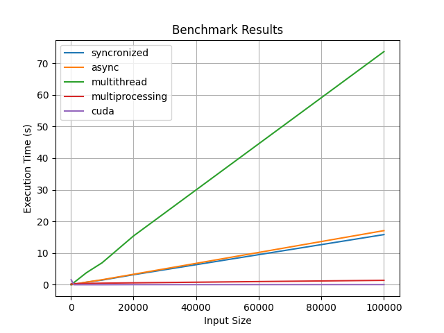

# Задача на сложные вычисления

Была реализована задача проверки массива целых чисел на простоту следующими подходами

1. **synchronized** - однопоточный
2. **async**
3. **multithread**
4. **multiprocessing**
5. **cuda**

## Результаты бенчмарка

## Объяснение результатов

Многопоточный вариант работает дольше, т.к. код в питоне все еще работает на одном
потоке, но ресурсы расходуются на синхронизацию и GIL. Асинхронный код
также исполняется на одном ядре, но не несет издержек синхронизации, поэтому
время примерно совпадает с однопоточной реализацией. Многопроцессовый код
быстрее однопоточного, т.к. исполнение возможно на разных ядрах, за счет
того что каждый поток работает на отдельном процессе интерпретатора.

На больших объемах данных `cuda` показывает себя лучше всего, т.к. на видеокарте
лучше выполняются примитивные параллельные вычисления. При этом примечательно,
что на небольших объемах данных он ведет себя медленнее из-за проблем
GPU underutilization. В переводе на русский у видеокарты много маленьких ядер, но
все они тупые.

